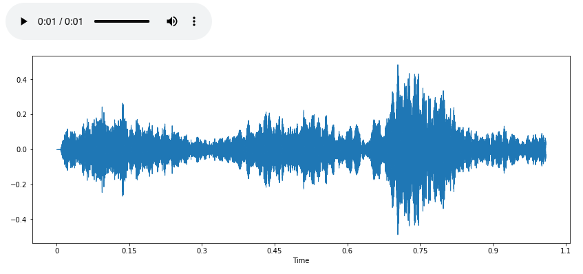
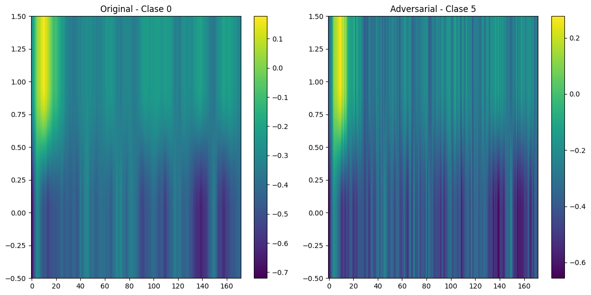
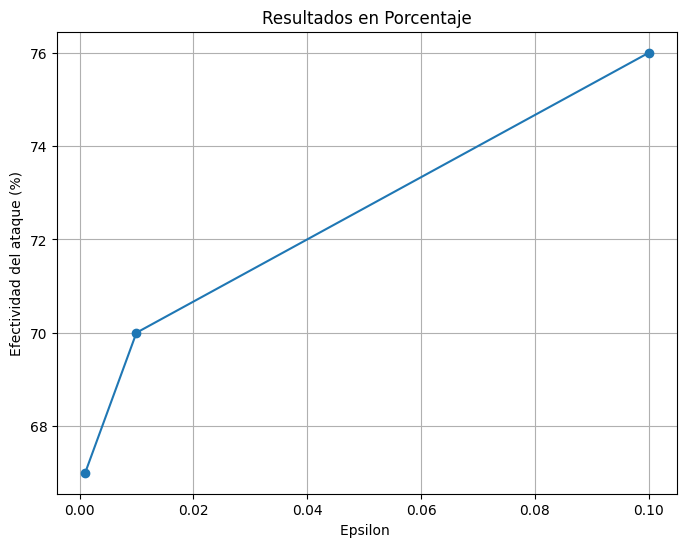

# Environmental-Sound-Classification-with-Deep-Learning

This project develops a machine learning model for environmental sound classification using the UrbanSound8K dataset. The primary objective is to identify various urban sound categories, such as sirens, dog barks, and street music, to support applications in public safety, environmental monitoring, and smart cities. The project explores the performance of two neural network architectures: Convolutional Neural Networks (CNNs) and Recurrent Neural Networks (RNNs), leveraging their unique strengths to process spectrograms and temporal features of audio data.

## Project Overview

Environmental sound recognition plays a crucial role in building intelligent systems for urban areas. By classifying audio signals into specific categories, these systems can enhance urban living through real-time monitoring and automated responses. The project evaluates the effectiveness of CNNs and RNNs in urban sound classification tasks and identifies the best model for accuracy, computational efficiency, and generalizability.

This project:
- Utilizes the UrbanSound8K dataset to classify environmental sounds across 10 distinct categories.
- Implements CNN, RNN, and CRNN architectures to capture both spatial and temporal features of audio data.
- Optimizes model performance through hyperparameter tuning, feature engineering, and 10-fold cross-validation.

## Table of Contents
- [Dataset Preparation](#dataset-preparation)
- [Deep Learning Architectures](#deep-learning-architectures)
- [Results](#results)
- [DeepFool Strategy](#deepfool-strategy)
- [Discussion and Future Work](#discussion-and-future-work)

## Dataset Preparation

1. **Dataset**:
   The UrbanSound8K dataset contains over 8,000 sound clips categorized into 10 classes (e.g., sirens, dog barks, street music). Each audio sample is labeled based on its primary sound source.

2. **Data Preprocessing**:
   - Raw audio files are transformed into spectrograms for input to CNNs and RNNs.
   - Noise reduction and normalization techniques are applied to enhance data quality.
   - Feature extraction, including mel-frequency cepstral coefficients (MFCCs), provides structured input representations.
   - Sound repetition to ensure constant-length vectors are fed into the neural networks.

3. **Exploratory Data Analysis**:
   Analysis of the dataset revealed class imbalances and foreground/background files. Highlighted key temporal and spectral patterns, guiding the choice of model architectures.

## Deep Learning Architectures

### Convolutional Neural Networks (CNNs)
- Capture spatial features from spectrograms.
- Designed with multiple convolutional layers, max pooling, and dropout for robust feature extraction.

### Recurrent Neural Networks (RNNs)
- Exploit temporal dependencies in audio signals.
- Built using gated recurrent units (GRUs) or long short-term memory (LSTM) layers for sequence modeling.
  
### Convolutional Recurrent Neural Networks (CRNNs)
- Convolutional layers are applied before feeding data into the RNN model, aiming to leverage the strengths of both convolutional and recurrent networks.
## Results

| **Model** | **Accuracy** | **F1 Score** | **Recall** |
|-----------|--------------|--------------|------------|
| RNN       | 0.41         | 0.39         | 0.41       |
| LSTM      | 0.58         | 0.57         | 0.58       |
| GRU       | 0.59         | 0.58         | 0.59       |
| CLSTM     | 0.60         | 0.59         | 0.60       |
| CNN       | 0.62         | 0.60         | 0.60       |

As can be seen, the CNN and CLSTM models exhibit the best results, demonstrating strong predictive power and robustness when applied to unseen samples. These models effectively capture both spatial and temporal features, contributing to their superior performance.
## DeepFool Strategy
DeepFool is an algorithm designed to identify the smallest possible changes, termed **adversarial perturbations**, that can mislead a classification model, particularly deep neural networks, into making incorrect predictions. This technique serves as a diagnostic tool, revealing the model's vulnerabilities and helping to improve its resilience against adversarial attacks.

The **L2DeepFoolAttack** was applied, leading to the misclassification of 100% of the examples. Additionally, we aimed to determine the epsilon level at which our model could resist adversarial attacks by employing **LinfPGD**. In this context, epsilon represents the magnitude of allowable perturbation, controlling the extent to which the input is altered.

The resulting outputs indicate that the model is susceptible to adversarial perturbations, with a considerable proportion of samples misclassified at low epsilon values.

## Discussion and Future Work

This project highlights the potential of deep learning models for environmental sound classification. However, further improvements could be achieved by exploring more advanced methods, such as the integration of attention mechanisms and/or transformers, which have shown promise in enhancing the model's ability to focus on relevant parts of the input data. Additionally, techniques like data augmentation, including time shifting, pitch shifting, and output stretching, could improve model generalization. Training with adversarial data may also help enhance robustness, enabling the model to better handle noisy or perturbed inputs. These approaches, combined, could potentially lead to even better performance in future experiments.

  
## Conclusion
The results demonstrate the feasibility of applying deep learning techniques to environmental sound classification. Both CNN and RNN models provide valuable insights into urban sound patterns, offering a foundation for further research and practical applications.

## Contributors
- [Alejandro Morís Lara](https://github.com/alejandromorislara)
- [Alfredo Flórez de la Vega](https://github.com/alfredofdlv)

## License
This project is licensed under the MIT License. See the [LICENSE](LICENSE) file for details.

## Acknowledgments
- UrbanSound8K Dataset: [https://urbansounddataset.weebly.com/](https://urbansounddataset.weebly.com/)
